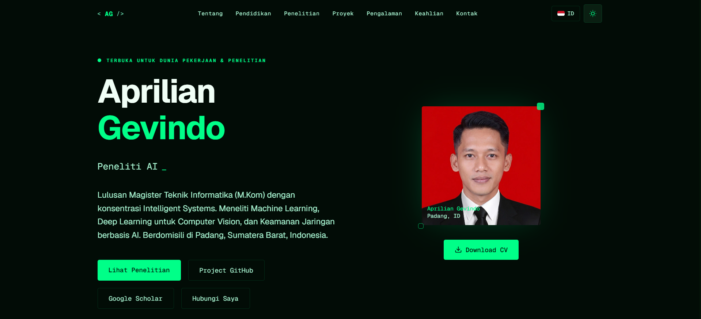

<div align="center">
  
  <h1 align="center">Aprilian Gevindo — Portofolio Personal</h1>
  <p align="center">
    <strong>Portofolio Bertema Cyberpunk Premium yang dibangun dengan Next.js 16 (App Router)</strong>
    <br />
    <br />
    <a href="https://liando.vercel.app">Lihat Demo</a>
    ·
    <a href="https://github.com/Liando18/profile/issues">Laporkan Bug</a>
    ·
    <a href="https://github.com/Liando18/profile/issues">Request Fitur</a>
  </p>
</div>

---

## 🌌 Gambaran Umum

Selamat datang di repositori portofolio personal saya! Ini adalah aplikasi web modern dan berperforma tinggi yang dirancang khusus untuk memamerkan riset, proyek, keahlian, dan pengalaman saya sebagai **AI Engineer & Full-Stack Developer**.

Mengusung desain estetika **Cyberpunk Hijau**, portofolio ini dilengkapi dengan mode Terang/Gelap (Light/Dark Mode) yang dinamis, animasi mikro yang halus, elemen antarmuka *glassmorphism*, dan tata letak responsif yang tampak memukau di seluruh perangkat.

<div align="center">
  
</div>

---

## ⚡ Fitur Utama

- 🌓 **Sistem Tema Dinamis** — Perpindahan yang mulus antara mode Terang dan Gelap (disimpan otomatis di *local storage*).
- 🌐 **Dukungan Bilingual** — Mendukung penuh bahasa Indonesia (ID) dan bahasa Inggris (EN).
- 🚀 **Next.js 16 App Router** — Dibangun dengan arsitektur Next.js terbaru untuk performa maksimum dan SEO yang handal.
- 🎨 **Tailwind CSS v4** — Tampilan berbasis utilitas yang dimodifikasi penuh, menggunakan CSS `color-mix()` modern untuk penanganan transparansi warna yang sempurna.
- 🤖 **Integrasi GitHub Langsung** — Mengambil dan menampilkan repositori secara *real-time* langsung dari GitHub REST API.
- 📱 **Mobile First & Responsif** — Pengalaman sempurna di desktop, tablet, maupun *smartphone*.
- 🔍 **Optimasi SEO** — Dilengkapi dengan Open Graph (OG), Twitter Cards, Sitemap, dan tag HTML semantik agar mudah diindeks oleh mesin pencari.
- ✨ **UI Cyberpunk Premium** — Teks bercahaya (glow), latar belakang garis pindaian (*scan-line*), batas beranimasi neon, dan tata letak futuristis.

---

## 🛠️ Teknologi yang Digunakan

| Peran | Teknologi |
| :--- | :--- |
| **Framework** | Next.js 16 (React) |
| **Bahasa Pemrograman** | TypeScript |
| **Styling** | Tailwind CSS v4 & Custom CSS |
| **Ikon** | Lucide React |
| **Font** | Geist Sans & Geist Mono |
| **Data Fetching** | GitHub REST API |
| **Deployment** | Vercel |

---

## 🚀 Panduan Instalasi

Untuk menjalankan *project* ini di komputer lokal Anda, ikuti langkah-langkah mudah berikut:

### 1. Clone repositori

```bash
git clone https://github.com/Liando18/profile.git
cd profile
```

### 2. Install dependensi

```bash
npm install
# atau
yarn install
# atau
pnpm install
```

### 3. Jalankan server lokal (development)

```bash
npm run dev
```

Buka [http://localhost:3000](http://localhost:3000) di browser Anda untuk melihat hasilnya.

---

## 🎨 Panduan Kustomisasi

Ingin menggunakan *template* ini untuk portofolio Anda sendiri? Anda dapat mengubah kontennya dengan mudah:

### Lokasi Perubahan Konten
Seluruh data personal berada di dalam folder `app/components/`.

- **`Hero.tsx`** — Nama Anda, teks perkenalan, dan teks animasi mesin ketik (peran).
- **`About.tsx`** — Biografi singkat, minat penelitian, dan sertifikat (mendukung paginasi).
- **`Research.tsx`** — Publikasi ilmiah dan karya tulis.
- **`Projects.tsx`** — Pastikan untuk mengganti *username* GitHub pada URL fetch: `fetch("https://api.github.com/users/USERNAME_ANDA/repos?...")`
- **`Skills.tsx`** — Keahlian teknis (AI/ML, Web, Basis Data) serta *soft skills*.
- **`Experience.tsx`** — Latar belakang pendidikan dan riwayat pekerjaan.

### Warna & Tema
Anda dapat menyesuaikan warna tema utama secara langsung melalui file `app/globals.css`:
```css
[data-theme="dark"] {
  --accent: #00ff88;         /* Hijau neon utama */
  --bg-primary: #020c06;     /* Latar belakang gelap */
}

[data-theme="light"] {
  --accent: #16a34a;         /* Hijau zamrud untuk mode terang */
  --bg-primary: #f0fdf4;     /* Latar belakang terang */
}
```

---

## 📬 Kontak & Sosial Media

**Aprilian Gevindo**

- 🐙 **GitHub**: [@Liando18](https://github.com/Liando18)
- 🎓 **Google Scholar**: [Lihat Profil](https://scholar.google.com/citations?hl=id&user=13b1AQgAAAAJ)
- 📧 **Email**: liando1801@gmail.com
- 💬 **WhatsApp**: 085835524290

---

<div align="center">
  <sub>Dibuat dengan ❤️ oleh Aprilian Gevindo. Jika repositori ini bermanfaat bagi Anda, jangan lupa berikan ⭐!</sub>
</div>
